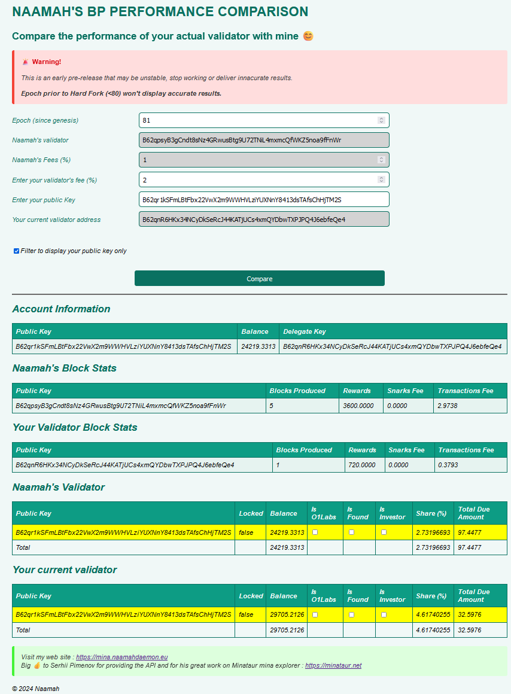

import bp from './naamah_bp_qrcode.png';

# Mina Payout Simulator
Have you ever wondered if your validator's performance was as good as you expected?  
How does it compare with other validators?  
What if you could compare it to another validator based on real epoch data?  

:::question
**How much would you have received if you had delegated to X instead of Y for this epoch?**
!!!

Stop tormenting yourself! Now you can compare your validator's performance with mine (or any other validator)!!

I've made this tool available to you.



Enter your key, click on **compare**, and you're good to go!

Find the tool here:

https://naamahdaemon.github.io/payout.html

:::warning disclaimer
This tool is provided as is.
This is an early version that may have some bugs or inconsistencies.
I have tested it though, and the results look reliable to me.
:::

Don't hesitate to contact me if you have any questions, problems, or comments.

* Discord  
naamah#8064  
* Naamah's Discord server  
https://discord.com/invite/ZkqQw8dK4E
* Telegram  
https://t.me/naamahdaemon
* Twitter  
https://twitter.com/NaamahDaemon

<br/>

# Support me by delegating to my Block Producer !

:::note My Validator Address 
```
B62qpsyB3gCndt8sNz4GRwusBtg9U72TNiL4mxmcQfWKZ5noa9fFnWr
```
:::

<div class="text--center">

</div>