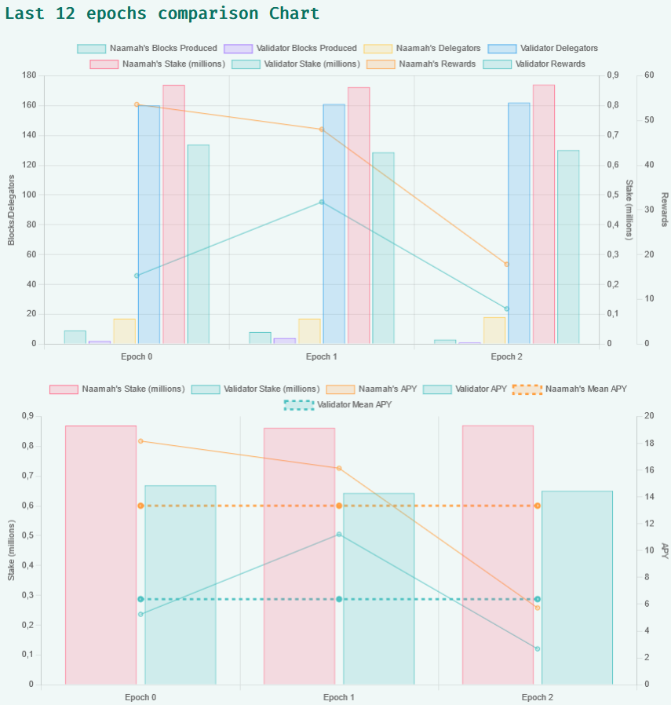

import bp from './naamah_bp_qrcode.png';
import minapackage from './mina-package.jpg';
import minapackagecontent from './package-content.jpg';

# Mina's surprise package to Berkeley participants
Today, I received a special package from Mina team 😊

<br/>

<div class="text--center">

</div>

<br/>

This box was sent to all the community members who helped on the mina berkeley transition.

And what we had in the box :

<br/>

<div class="text--center">

</div>

<br/>

**Thanks to the Mina team and all the awesome Mina community !! 🎉**

* * *
# Naamah's payout simulator tool updated
This week, I also updated my Mina Payout Simulator tool.
Added Block Producer APY comparison.

<br/>



<br/>

See by yourself :
  
https://mina.naamahdaemon.eu/payout-simulator
  
* * *

# Support me by delegating to my Block Producer !

:::note My Validator Address 
```
B62qpsyB3gCndt8sNz4GRwusBtg9U72TNiL4mxmcQfWKZ5noa9fFnWr
```
<div class="text--center">

</div>
:::


