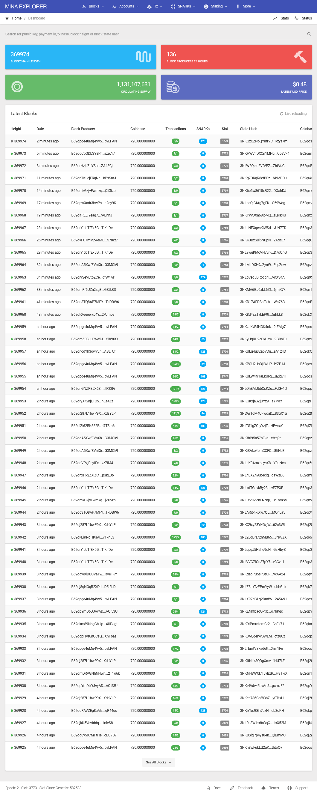
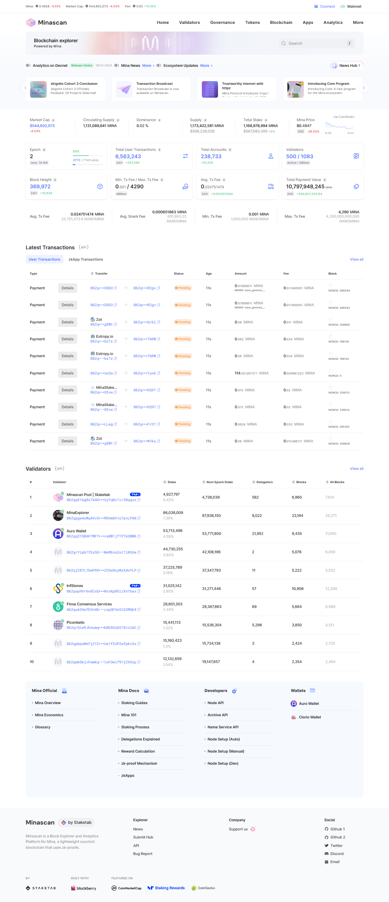
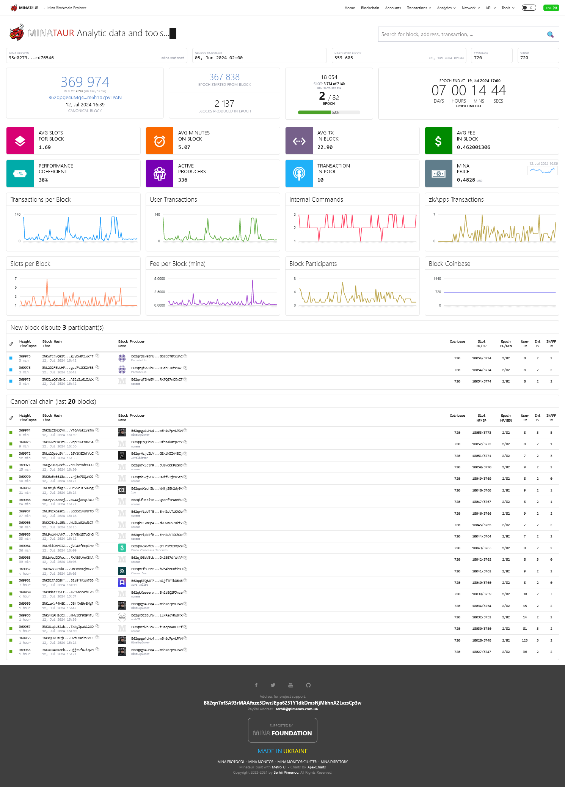

import bp from '../assets/naamah_bp_qrcode.png';

[//]: # (Mina explorers)
# Mina explorers
3 main Mina explorers are available :

## **Mina Explorer** *by Gareth Davis*
https://www.minaexplorer.com  



:::note
One of the first (if not the first) Mina explorer available provided by one of the most awesome Mina contributors of all time !
:::

You'll find almost all what you need on this explorer :

* [Real time blockchain block production](https://minaexplorer.com/blocks)
* [Account information](https://minaexplorer.com/ledger)
* [Transactions Information](https://minaexplorer.com/transactions)
* [Snarks production](https://minaexplorer.com/snarks)
* [Staking Ledger](https://minaexplorer.com/staking)
* [Rest Api](https://docs.minaexplorer.com/rest-api)

... and much more

:::info
Gareth also provides a graphQL Proxy here :  
https://graphql.minaexplorer.com/
:::

## **Minascan** *by Staketab*
https://minascan.io/mainnet/home  



:::note
Provides a lot of services and blockchain information
:::

* [Validators leaderboard](https://minascan.io/mainnet/validators/leaderboard)
* [Validators Terms and conditions](https://minascan.io/mainnet/validators/terms)
* [Realtime block production](https://minascan.io/mainnet/blocks)
* [User transactions](https://minascan.io/mainnet/txs/user-txs)
* [User accounts](https://minascan.io/mainnet/accounts)
* [Blockchain analytics](https://minascan.io/mainnet/analytics/network)

:::info
Staketab also provide the blockberry API available here :  
https://docs.blockberry.one/reference/welcome-to-blockberry-api
:::

## **Minataur** *by Serhii Pimenov*
https://minataur.net/  



:::note
Another great Mina explorer with exclusive functionnalities !
:::

Minataur provides usual information about Mina blockchain :

* [Real time blockchain block production](https://minataur.net/blockchain)
* [Accounts](https://minataur.net/accounts)
* [Transactions](https://minataur.net/transactions)
* [Block Producers](https://minataur.net/producers)

... and much more

:::info
Serhii also provides some exclusive functionalities such as:  
* Restful Api  
https://minataur.net/api/restful
* Graphical block distribution  
https://minataur.net/analytics/blocks-distribution
* Profit calculator  
https://minataur.net/tools/profit-calculator
:::

## Naamah Validator information
You will find my validator on each of those explorers :

**minataur.net**  
https://minataur.net/account/B62qpsyB3gCndt8sNz4GRwusBtg9U72TNiL4mxmcQfWKZ5noa9fFnWr

**minaexplorer.com**  
https://minaexplorer.com/wallet/B62qpsyB3gCndt8sNz4GRwusBtg9U72TNiL4mxmcQfWKZ5noa9fFnWr

**minascan.io**  
https://minascan.io/mainnet/validator/B62qpsyB3gCndt8sNz4GRwusBtg9U72TNiL4mxmcQfWKZ5noa9fFnWr/delegations
  
Feel Free to delegate to my block producer !

:::note My Validator Address 
```
B62qpsyB3gCndt8sNz4GRwusBtg9U72TNiL4mxmcQfWKZ5noa9fFnWr
```
<div class="text--center">

</div>
:::


