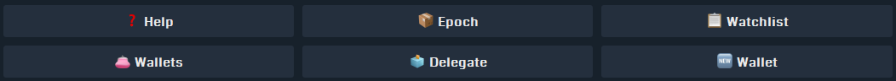

---  
sidebar_position: 14  
sidebar_label: Mina Wallet Bot  
sidebar_class_name: green  
---  

# Mina Telegram Bot  

**Mina Wallet & Alerts on Telegram**  
A Telegram bot that brings Mina blockchain features right where your community already is.  

Add the bot to Telegram:  
:::tip MINA_WALLET_BOT  
[https://t.me/mina_monitor_bot](https://t.me/mina_monitor_bot)  
:::  

  

---  

## What the bot can do  

- **Wallets in Telegram**: create, encrypt & store, list, set default, reveal private key (with password), delegate stake, send payments, tip users, claim faucets, and run **rain** distributions  
- **Address & Validator Watching**: get alerts on transactions, delegations, zkApps, token transfers; get notified on validator block production (canonical/orphan)  
- **On-chain Insights**: get current block/epoch, resolve truncated addresses, validator stats, payout estimations per epoch  
- **Leaderboards & Referrals**: tips leaderboard and referrer leaderboard (public groups) + personal referral settings  
- **Mini-Games** *(public groups)*: **/dice_roll** and **/guess** (configurable tries & bet multiplier) with token stakes  
- **Mina Price Chart**: view a quick price chart via `/pc`  
- **Faucet Claim**: get 5 test MINA on **zeko_testnet** or **devnet** via `/faucet`  
- **Multi-Network**: `mainnet | devnet | zeko_testnet` (defaults indicated per command)  

> 🧭 **Convention**  
> - Angled brackets `<...>` = required  
> - Square brackets `[...]` = optional  
> - `_italics_` = default value  
> - Aliases are shown with a pipe: `/command | /alias`  

---  

## Security & Custody Model  

Your private key is securely encrypted and stored on our servers using modern cryptography (**AES-GCM**) and a password known **only to you**.  
We **never store your password**, and it is **never logged or sent anywhere** beyond the secure Telegram channel you use to communicate with the bot.  

When you perform an action that requires your private key (such as signing a transaction), the bot **temporarily decrypts your key in memory only**, using your password, to sign the requested operation.  
Immediately afterward, the key and decrypted data are **permanently wiped from memory**.  

Even in the event of a **data breach or database leak**, your encrypted keys would remain **mathematically unusable** without your password.  

The bot server itself is **not directly reachable from the Internet** — it communicates exclusively through **Telegram’s secure API channels**.  

### What This Means  

- Only **you** can use your key — nobody else knows your password.  
- Your key **never leaves** the secure server environment in decrypted form.  
- The server **cannot access or recover** your key without your password.  
- The system provides a **level of protection comparable to local non-custodial wallets**.  

However, because decryption and signing occur on the server (under your explicit command), this wallet is **not strictly “non-custodial”** in the pure cryptographic sense.  
It is best described as a **secure custodial wallet with zero-knowledge encryption** — combining **strong security**, **simplicity**, and **user control**.  

#### Summary  

| **Aspect** | **Description** |  
| --- | --- |  
| **Encryption** | AES-GCM with Argon2 password-derived key |  
| **Password** | Known only by the user, never stored or logged |  
| **Decryption** | Performed temporarily in memory for each operation |  
| **Exposure** | No inbound ports, Telegram API only |  
| **Custody classification** | Secure custodial (zero-knowledge) |  
| **External attack surface** | Extremely low |  

---  

## Private Chat Commands  

> DM the bot to manage your wallets, watchlists, referrals, and alerts.  
> Some commands have aliases for convenience.  

### Watchlists  

#### Watch a wallet address  
`/watch | /wa <address> <label>`  
Receive alerts for:  
- Payment in/out  
- Delegation in/out  
- zkApps  
- Token transfers  

**Example**  
```
/watch B62qrmRJ...C7agyYEZ MY_WALLET
```  

#### Unwatch a wallet address  
`/unwatch | /ua <address>`  

#### Watch a validator (block producer)  
`/watch_validator | /wv <validator_address> <label>`  

**Example**  
```
/watch_validator B62qpsyB...a9fFnWr Naamah
```  

#### Unwatch a validator  
`/unwatch_validator | /uv <validator_address>`  

#### Rename any watched entry (address or validator)  
`/rename | /rn <address_or_validator> <label>`  

#### List all watched items  
`/list | /l`  

---  

### Wallet Management  

#### Create wallet  
`/create_wallet | /cw`  
Prompts for a password, creates a keypair, encrypts the private key, and stores it securely.  

#### Delete a wallet  
`/user_delete_wallet`  
Removes a Mina wallet from your list.  

#### List your wallets  
`/list_wallets | /lw`  
Shows your public addresses. The **default** one is marked.  

#### Set default wallet  
`/set_default | /sd <wallet_address>`  
Sets `<wallet_address>` as your default for tip/send operations.  

#### Show private key  
`/show_private_key | /spk [<public_key>]`  
Reveals your private key after password verification. If you have multiple wallets, specify the public key.  

#### Delegate stake (from your Telegram wallets)  
`/delegate`  
Interactive flow to delegate the stake of your Telegram-managed wallets.  

---  

### Transfers & Tools (DM)  

> Unless stated otherwise, **default network is _mainnet_**.  
> You can override with `devnet` or `zeko_testnet` when supported.  

#### Build & send with Auro (deeplink)  
`/send <recipient_address> <amount> <fee> [memo] [network_id (**mainnet**|devnet|zeko_testnet)]`  
Builds a payment link and opens Auro for signing/broadcast.  

#### Tip from your wallet(s)  
- Single-wallet flow:  
  `/tip <to> <amount> <fee> [memo] [*mainnet*|devnet|zeko_testnet]`  
- Multi-wallet flow (explicit source):  
  `/tip <from> <to> <amount> <fee> [memo] [*mainnet*|devnet|zeko_testnet]`  

> `to` can be a **B62** address or an **@username** (if they have a registered wallet).  

#### Faucet (DM)  
`/faucet [devnet|zeko_testnet]`  
Claim a **5 MINA faucet** on `zeko_testnet` or `mina devnet` (limited to **1 faucet per user**).  

#### Check balances  
- Address:  
  `/balance | /b <address> [*mainnet*|devnet|zeko_testnet]`  
- All wallets of an @username:  
  `/balance | /b <@username> [*mainnet*|devnet|zeko_testnet]`  

#### Price chart  
`/pc` – Displays Mina price chart.  

---  

### Alerts & Stats (DM)  

#### Empty coinbase alert  
`/alert_coinbase | /ac on|off`  
Enable/disable global alerts when a block is produced with **empty coinbase**.  

#### Validator stats  
`/validator_stats | /vs [epoch] [validator]`  
- No args → show global stats (current epoch)  
- With `epoch`/`validator` → filter results  

#### Resolve truncated address  
`/get_full_address | /gf <short_address>`  
Resolve `B62...abcd` → full address  

#### Block & epoch info  
- Current block/epoch/slot:  
  `/get_block | /gb`  
- Specific block:  
  `/get_block | /gb <height>`  

#### Show all blocks (live scroll)  
`/show_all` – Live stream of produced blocks (use with care).  

---  

### Referrals (DM)  

#### Show / update my referral  
`/my_referral | /mr`  
View or set your referrer code/username to participate in **referral leaderboards**.  

---  

### Help & Menus (DM)  

#### Help  
`/help` – Displays this help menu with all available commands.  

#### Menu  
`/menu` – Opens the interactive button-based menu for quick access to main bot functions.  

You can trigger the **menu** at any time to quickly access the main sections of the bot such as wallet management, delegation, epoch info, or watchlist.  

  

> The menu allows users to easily navigate core features without remembering all command names.  
> Each button corresponds to one of the major functional areas:  
> - ❓ **Help** — Displays the list of all available commands  
> - 📦 **Epoch** — Shows current epoch, slot, and block information  
> - 🗒️ **Watchlist** — Manage your watched addresses and validators  
> - 💰 **Wallets** — Manage your Mina wallets (create, list, set default, etc.)  
> - 🧭 **Delegate** — Delegate your stake to a validator  
> - 🆕 **Wallet** — Quickly create a new Mina wallet  

---  

## Public Group Commands  

> Use these in public groups. Some actions (like **rain** or **games**) will require a **DM confirmation** (password) by involved players for security.  

### Info & Tools  

- `/pc` — Show Mina Price Chart  
- `/get_block | /gb` — Current block height, epoch, slot  
- `/get_block | /gb <height>` — Show block info for `<height>`  
- `/help` — Quick help  
- `/menu` — Open quick access menu  
- `/balance | /b <address>` — Show balance in MINA  
- `/balance | /b <@username> [mainnet|devnet|zeko_testnet]` — Show all balances of an @user (default: mainnet)  
- `/faucet [devnet|zeko_testnet]` — Claim a **5 MINA faucet** on zeko_testnet or mina devnet (1 faucet per user)  

---  

### Wallet Actions in Group  

> These actions will ask the **sender** to confirm in **DM** (password) if they require signing.  

#### Create wallet (guided in DM)  
`/create_wallet | /cw`  
Starts wallet creation flow (continues in DM).  

#### Tip a user  
`/tip @telegram_user <amount> [fee] [memo] [*mainnet*|devnet|zeko_testnet]`  
Sends a tip from your **default** wallet. DM confirmation may be required.  

#### Rain (random distribution)  
`/rain <amount> <nb_users> [fee] [memo] [network_id (**mainnet**|devnet|zeko_testnet)]`  
Randomly distribute `<amount>` among `<nb_users>` **eligible** members (must have a wallet & be in this group).  
Requires DM confirmation (password). Summary posted in group.  

---  

### Leaderboards (Group)  

- `/leaderboard | /lb [*mainnet*|devnet|zeko_testnet] [YYYY-MM-DD] [YYYY-MM-DD]`  
  Tip leaderboard over an optional date range and network.  
- `/reflb`  
  Referrer leaderboard.  

---  

### Mini-Games (Group)  

> Players must have wallets & will **confirm in DM** before any transfer/signing.  
> First, users may need to opt-in to games (e.g. via a private `/game` toggle if you keep that anti-spam switch).  

:::failure  IMPORTANT
Games are only available on testnets/devnets.
:::

#### Dice Roll  
`/dice_roll @username <amount> [network_id (devnet|**zeko_testnet**)]`  
Challenge another user to a dice roll. Highest roll wins the pot.  

- Bot DM flow: both players confirm with password  
- On success: winner receives `<amount>` from the loser (or split pot if you configured a pot logic)  

**Example**  
```
/dice_roll @alice 1
```  

#### Guess My Number  
`/guess @username <amount> [number_of_tries(_default: 5_)] [bet_multiplier(_default: 1_)] [network_id (devnet|**zeko_testnet**)]`  
Challenge another player to guess a number between **1 and 100**.  

- `number_of_tries`: how many guesses the opponent gets (default **5**)  
- `bet_multiplier`: if the opponent finds the number, they win **multiplier × amount**; if not, the starter wins **1 × amount**  

**Examples**  
```
/guess @alice 2
/guess @alice 2 7 3
/guess @alice 2 7 3 zeko_testnet
```  

> The final DM result message includes the **secret number** for transparency.  

---  

## Examples (Copy-Paste Ready)  

### Watch a wallet & get alerts (DM)  
```
/wa B62qrmRJ...C7agyYEZ MY_WALLET
```  

### Watch a validator & get block alerts (DM)  
```
/wv B62qpsyB...a9fFnWr Naamah
```  

### Enable Empty Coinbase alerts (DM)  
```
/ac on
```  

### Get validator stats for an epoch (DM)  
```
/vs 106 B62qrYi...tTiKhDe
```  

### Resolve a short address (DM)  
```
/gf B62qpge...7pvLPAN
```  

### Claim faucet (DM or Group)  
```
/faucet zeko_testnet
```  
  
### Open menu (DM or Group)  
```
/menu
```  

### Show current block (Group or DM)  
```
/gb
```  

### Show a specific block (Group or DM)  
```
/gb 464299
```  

### Tip a user in group  
```
/tip @alice 1 0.01 gz for testing zeko_testnet
```  

### Rain 10 MINA over 5 users in group (mainnet default)  
```
/rain 10 5 0.01 Party time!
```  

### Create a wallet (Group → continues in DM)  
```
/cw
```  

### Dice Roll (Group)  
```
/dice_roll @alice 1 zeko_testnet
```  

### Guess My Number (Group)  
```
/guess @alice 2 7 3 zeko_testnet
```  

---  

## Payout Estimator (DM)  

`/get_payouts epoch=<num> publicKey=<validator> delegatePubkey=<delegator> [poolFee=5] [foundFee=8] [o1labsFee=5] [shareTxFee=0|1|2]`  

- With only `epoch` & `publicKey`: validator’s production & rewards for the epoch  
- Add `delegatePubkey` to estimate **delegator** returns  

**Example**  
```
/get_payouts epoch=106 publicKey=B62qrYi...tTiKhDe
```  

---  

## Notes & Best Practices  

- **Security first**: The bot will **always** ask for your password in DM before any action requiring your private key.  
- **Networks**: Many commands default to **mainnet**; specify `devnet` or `zeko_testnet` when needed.  
- **Aliases**: Use the short forms (`/wa`, `/wv`, `/uv`, `/rn`, `/lw`, `/sd`, `/spk`, `/vs`, `/gf`, `/gb`, `/ac`, `/lb`) for faster typing.  
- **Gaming opt-in**: If enabled in your deployment, users must first opt-in via a private `/game` toggle to avoid spam.  
- **Group eligibility** (rain/games): Users must have a wallet registered and be present in the group.  
