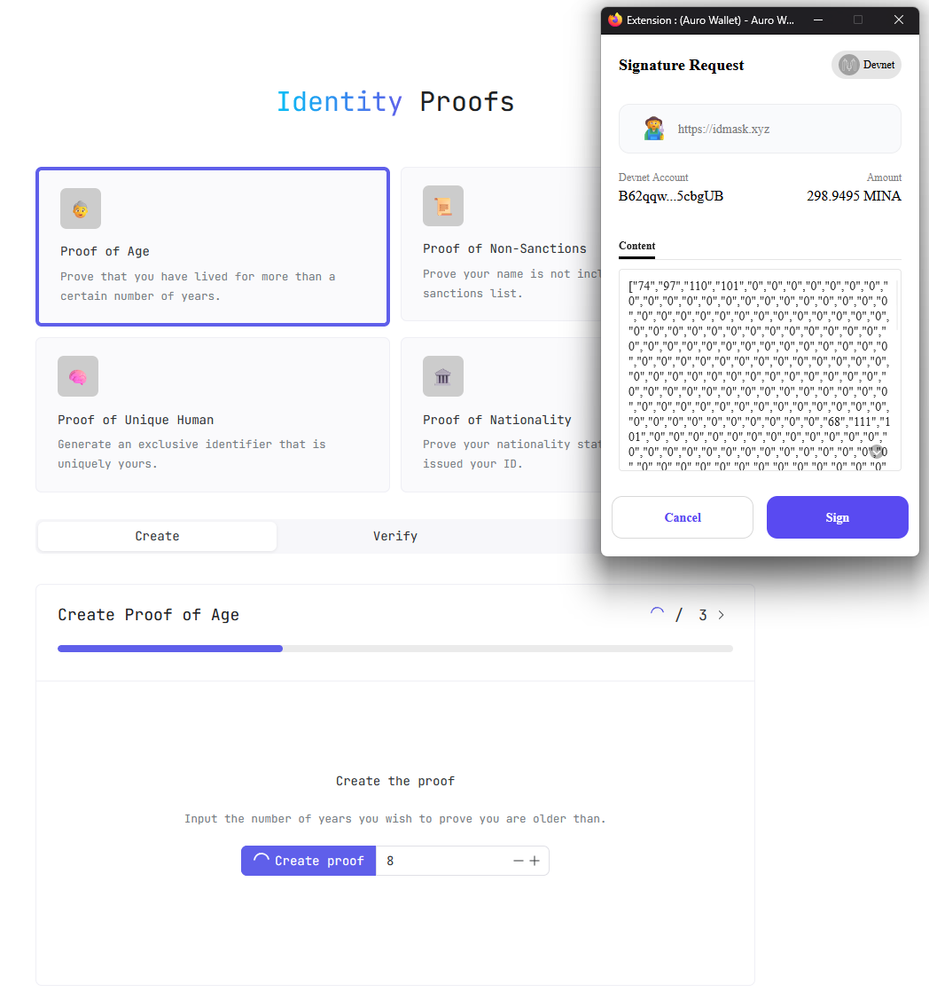
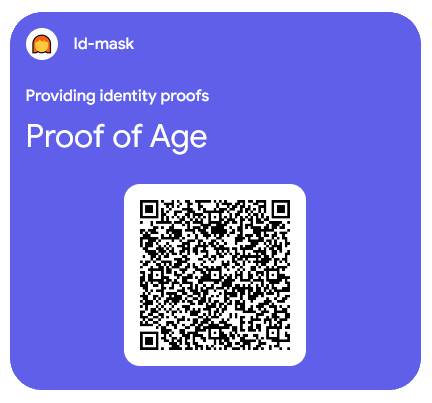
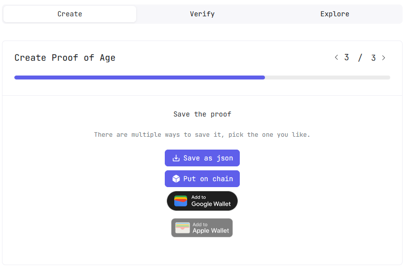

# ID-Mask

## App Identity file

|  Param | Value |
| ---- | ----- |
| **Author** | [maren@ethenticator.io](mailto:maren@ethenticator.io) |
| **Contacts** | Discord ID: iowxss6 |
| **Twitter / X** | https://twitter.com/RaidasG |
| **URL**  | https://idmask.xyz |
| **Code** | https://github.com/id-Mask |
| **Official documentation** | https://docs.idmask.xyz/ |
| **Availability** | TESTNET / MAINNET |

## TESTNET Smartcontracts addresses

|  Param | Value |
| ---- | ----- |
| Proof of age          | https://minascan.io/devnet/account/B62qqpAFkz374qJpuFKYZPjT1KxSmnLoY4zEc878FaW4DSxgYNXZiny |
| Proof of non-sanction | https://minascan.io/devnet/account/B62qqhjvvE3dwiX2hF2cZRfmHA7euo8MrzvZhPHgXJNb57vuiWePAWC |
| Proof of unique human | https://minascan.io/devnet/account/B62qk9ydrTZwmHDVC2CNjQz7FGUkpMhaK2LMTGecX6484PakNCzegzn |
| Proof of nationality  | https://minascan.io/devnet/account/B62qnVvgzispkNmAoPCFGn5bpUiYxd84aakDnqHQDaPsYew2nL3SSKH | 

## MAINNET Smartcontracts addresses

|  Param | Value |
| ---- | ----- |
| Proof of age          | https://minascan.io/mainnet/account/B62qqpAFkz374qJpuFKYZPjT1KxSmnLoY4zEc878FaW4DSxgYNXZiny |
| Proof of non-sanction | https://minascan.io/mainnet/account/B62qqhjvvE3dwiX2hF2cZRfmHA7euo8MrzvZhPHgXJNb57vuiWePAWC |
| Proof of unique human | https://minascan.io/mainnet/account/B62qk9ydrTZwmHDVC2CNjQz7FGUkpMhaK2LMTGecX6484PakNCzegzn |
| Proof of nationality  | https://minascan.io/mainnet/account/B62qnVvgzispkNmAoPCFGn5bpUiYxd84aakDnqHQDaPsYew2nL3SSKH | 

* * *
## App Visuals

* * * 
## App description
From the original web site :

:::info  Description
idMask is an app that enables the creation of zero-knowledge proofs, empowering individuals to verify statements about their identity to third parties without disclosing any personal information.  
  
Produced proofs can be utilized by other parties that find it useful, for example other apps, governments, DEX'es and what not.
:::

ID-Mask allows anyone to generate several kind of proofs, provided by trustful sources (supported trust source on mainnet is the 
Smart-ID identity application ([see below](#smartid)).  

* Proof of Age
* Proof of non-sanctions
* Proof of unique Human
* Proof of Nationality

It is possible to simulate id verification on testnet in order to have an overview of the way it is working.  

:::note
As I cannot use smart-id in my country, I was not able to real test proof generation on mainnet.  
Instead I only performed tests on testnet using automatically generated dummy data.  
:::

Once the proof is generated, then it can be either kept local (front-end generated proof) or be propagated onchain or in Google or Apple Wallet so it can be presented to proove your statements whenever it is required to a 3d party verifier. 

* * *
## Settings

Settings allows you to change the behaviour of the application :

* Switch network (MAINNET / DEVNET)
* Change service URL (GraphQL endpoints, Explorer endpoints , ..)
* Activate Console debug logs
* Make user wallet signature mandatory for proof generation
* Use Cache to improve proof generation/verification speed 
* ...

* * * 
## Let's give it a try !
### Pre-requisites
In order to test ID-Mask, you will need :  

* A Mina wallet (Auro / Clorio / Pallad)
* A Mina testnet address that you created from your favorite wallet
* Some Minas on your account ([see below](#faucet))

And this is all you will need !

:::warning  Using ID-Mask from your mobile phone
Theoritically, you can use ID-Mask from your wallet embedded web browser to connect your address to ID-Mask and sign the smart contracts.  
It appears as for now, this is not really usable from a mobile phone as proof generation occurs on the front-end side and requires some CPU power and is way too long on a mobile phone.  
For this reason, I will advise that you try from your desktop web browser using the web extension of your favorite wallet.  
:::

### Proof Generation
As stated above, ID-Mask can generate 4 categories of proofs :

* Proof of Age
* Proof of non-sanctions
* Proof of unique Human
* Proof of Nationality

Let's try with the first one : **Proof of Age**

#### STEP 1 - Get Mocked Data

#### STEP 2 - Create the Proof

If you required from the settings that your wallet signed the generated proof then your web extension wallet should open and let you sign the request.  

#### STEP 3 - Save the generated proof
Once the proof is generated, you can save it for later user by verifier :

* In a JSON file
* By putting it onchain
* By adding it to your Google or Apple wallet

Let's put our proof onchain by clicking on **Put on chain**.

:::note
It may take quite some time so be patient 😉
:::

Accept the transaction in your wallet

Once everything is ok, you'll notice a popup informing you that the transaction is now onchain.  
You can click on the link that will redirect you to the transaction details in a mina explorer.  

In my example : https://minascan.io/devnet/tx/5JvCdR2A9EQixYNCAEUUo4HbWzkgz7x2b4Zc762r5MCU1zw9Kj73?type=zk-tx

* * *
### Proof Verification
You can then have your generated proof verified either by :
* Uploading the JSON file generated above
* Checking your Mina address if you put your proof onchain
* Scanning the Google/Apple Wallet Proof QRCode

* * * 
## Notes   

### smart-id
:::note  Smart-ID Application 
Smart-ID is an electronic identification solution designed to allow users to authenticate securely online and electronically sign documents. Key points about Smart-ID include :  

* Electronic Authentication  
Smart-ID enables users to digitally authenticate and electronically sign documents online. This includes banking transactions, government services, digital contracts, and more.  

* Security  
The application employs advanced security methods to protect users' personal information and ensure the integrity of electronic transactions.

* Usage  
Smart-ID is widely used in countries where it is deployed as a secure and convenient alternative to traditional methods of identification and signing.

* Countries of Use  
Initially developed in Estonia, Smart-ID is now utilized in several European countries where it is integrated into national electronic identification systems.

* Typical Applications  
Typical uses of Smart-ID include secure access to online services, authentication for online banking services, access to digital government services, electronic document signing, and more.

Countries where Smart-ID is commonly used include Estonia, Latvia, Lithuania, and other European countries where it has been adopted as part of their digital infrastructure.
:::

### DEVNET/TESTNET Faucet
:::note  Request a DEVNET/FAUCET 
Once you have created your wallet address on TESTNET through Auro/Clorio/Pallad, you can request some tMINA to test.  
For this fill in your wallet address on this page : https://faucet.minaprotocol.com/
:::