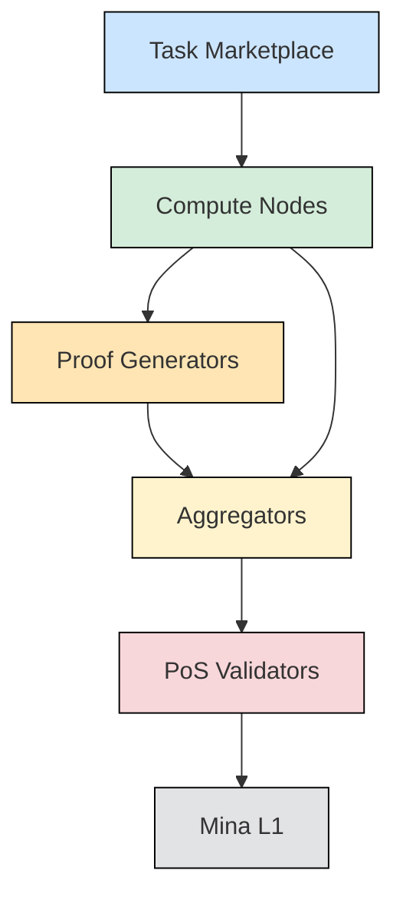
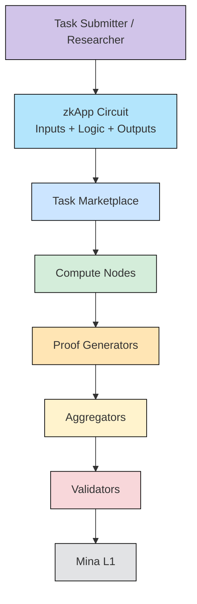
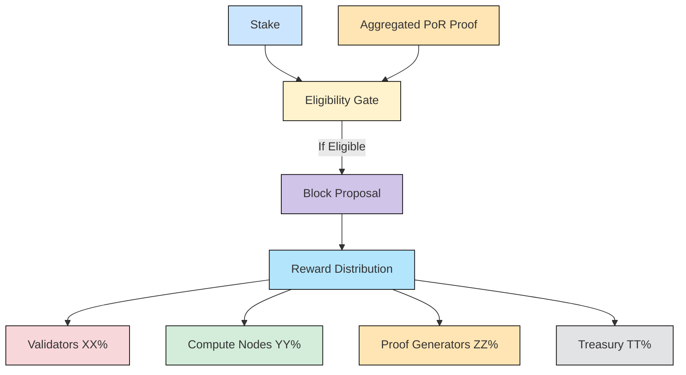
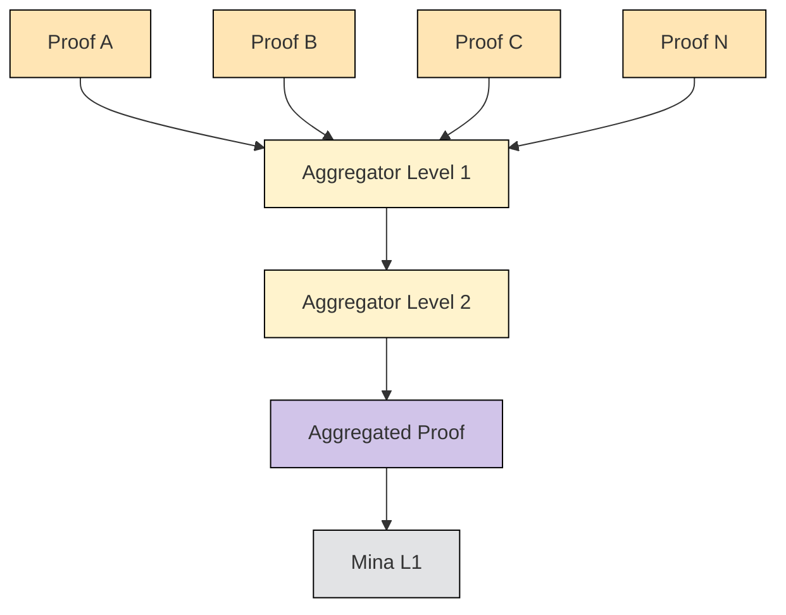

# Proof of Research (PoR) on Mina Protocol

---
## Preamble: Why Useful Proof of Work Was Impossible Before ZK
For years, researchers and developers have explored the idea of turning Proof of Work into something useful — so that instead of burning energy on meaningless hashing, networks could contribute to science, AI, or data analysis.  

However, this idea always faced a fundamental obstacle: **how to verify useful work efficiently**.  

Any useful computation, such as training an AI model, sequencing DNA, or analyzing large datasets, is inherently expensive to compute and equally expensive to verify. Without a way to separate the cost of computation from the cost of verification, blockchains could not safely use such tasks for consensus.  


This is why early *Proof of Useful Work* projects (Primecoin, CureCoin, FoldingCoin) struggled to gain adoption: they lacked a verification method that was both fast and cryptographically sound.  

**Zero-Knowledge Proofs (ZKPs)** changed this equation. With zk-SNARKs, zk-STARKs, and especially recursive proofs as implemented in **Mina Protocol**, it became possible to prove the correctness of a computation once, and let anyone verify it in milliseconds.  

This decouples the heavy cost of performing useful research from the trivial cost of verification.  
In other words, ZKPs are the missing link that transforms Proof of Useful Work from an impractical dream into a feasible consensus mechanism.  


---

## Abstract
We introduce **Proof of Research (PoR)**, a novel consensus mechanism that transforms blockchain security into a vehicle for useful computation.  

Unlike Proof of Work (PoW), where energy is expended on meaningless hashing, PoR leverages **Zero-Knowledge Proofs (ZKP)** and Mina Protocol’s **recursive cryptography** to validate real-world scientific and computational tasks as part of block production.  

This creates the first blockchain where the act of securing the network simultaneously contributes to scientific progress, AI training, bioinformatics, and large-scale data analysis.  


---

## Related Work
Over the past decade, multiple projects have attempted to connect blockchain security with useful computation. While these efforts demonstrated creativity, none have succeeded in building a fully decentralized, verifiable, and secure consensus mechanism based on useful work.  


- **Primecoin (2013)**: used mining to discover prime number chains. Valuable but extremely narrow in scope.  
- **CureCoin / FoldingCoin**: rewarded contributions to Folding@home but relied on external verification.  
- **Gridcoin**: connected to BOINC computing, again dependent on trusted external servers.  
- **Golem, iExec, Akash**: decentralized compute marketplaces, but separate from consensus.  
- **Bittensor (2021)**: incentivized AI training, but verification remained benchmark-based, not cryptographic.  


**Why PoR is different:**  

- ZKPs enable cryptographic proofs of useful computation, verified in milliseconds.  
- Recursive aggregation (Mina) condenses thousands of proofs into one succinct proof.  
- A **hybrid PoS + PoR** design ties consensus to both financial stake and useful research contributions — a combination never previously achieved.  


---

## Architecture
The following diagram illustrates the high-level architecture of Proof of Research on Mina Protocol:  

📌 **[Diagram Placeholder: Global Architecture — Task Marketplace → Compute Nodes → Proof Generators → Aggregators → Validators → Mina L1]**  



```text
+-------------------------------+
| Task Marketplace              |
| (posts zkApps/tasks, pays)    |
+-------------------------------+
               |
               v
+------------------------+          +----------------------+
| Compute Nodes          |  results | Proof Generators     |
| (run zkApp logic)      +--------->| (produce zk-proofs)  |
+------------------------+          +----------------------+
            \                              /
             \                            /
              v                          v
               +------------------------+
               |      Aggregators       |
               | (recursive proof merge)|
               +------------------------+
                         |
                         v
                +------------------+        anchor snark       +------------------+
                |   Validators     |-------------------------->|     Mina L1      |
                | (PoS consensus,  |                           | (succinct verify) |
                | embed agg proof) |<-- finality/fork choice --+------------------+
                +------------------+

Token flows (conceptual):
Users/Submitters -> pay tokens -> Marketplace -> rewards -> Compute Nodes / Provers / Validators

```

---

## Roles
- **Task Submitters (Researchers / Enterprises / Individuals)**: Publish useful computational tasks and pay in tokens for execution.  
- **Compute Nodes (Workers)**: Execute assigned tasks using CPUs/GPUs and generate raw results.  
- **Proof Generators (Provers)**: Produce zk-proofs certifying correctness of computations.  
- **Aggregators**: Combine many zk-proofs into a single recursive proof.  
- **Validators (PoS Layer)**: Secure consensus and include aggregated proofs in blocks.  
- **Mina L1**: Anchors the final proof, ensuring trust, immutability, and global verifiability.  

---

## zkApps as Research Circuits
One of Mina’s unique strengths is the ability to express computations as **zkApps** — zero-knowledge smart contracts.  
In the context of PoR, **task submitters could provide zkApps representing their research problems**. 


Each zkApp would define:  

- **Inputs**: research data (datasets, parameters, genetic sequences, model weights, etc.).  
- **Logic (circuit)**: the algorithmic computation to be performed (e.g., matrix multiplication, alignment algorithm, AI training step).  
- **Outputs**: the computed result **plus a zk-proof** certifying that the computation was executed correctly.  

This model allows every research task to be formalized as a verifiable circuit. Compute nodes simply execute zkApps with provided inputs, generating results and proofs. Aggregators then combine these proofs recursively into a single succinct certificate of research, which validators embed into the blockchain.  

In practice, this transforms the blockchain into a **library of reusable, verifiable research circuits**.  
Any researcher can design and deploy zkApps for their field, enabling a global decentralized marketplace of provable scientific computation.  


📌 **[Diagram Placeholder: zkApps Flow — Submitter provides zkApp → Compute Nodes run zkApp with inputs → Proof Generated → Aggregator → Validators → Mina L1]**  



```text
[ Task Submitter / Researcher ]
             |
             v
   +-----------------------+
   |  zkApp (Circuit)      |
   |  - Inputs schema      |
   |  - Logic (algorithm)  |
   |  - Outputs spec       |
   +-----------------------+
             |
   publish to Marketplace
             |
             v
+------------------------+      data batches      +-----------------------+
|    Compute Nodes       |<---------------------->|   Data Providers      |
| (execute zkApp w/      |                        | (datasets, params)    |
|  inputs -> results)    |----------------------->|                       |
+------------------------+     results            +-----------------------+
             |
             v
+------------------------+
|  Proof Generators      |
| (result -> zk-proof)   |
+------------------------+
             |
             v
+------------------------+
|     Aggregators        |
| (recursive combine)    |
+------------------------+
             |
             v
+------------------+          +------------------+
|    Validators    |  snark   |     Mina L1      |
| (PoS; include    +--------->| (verify succinct)|
|  agg proof)      |          +------------------+
+------------------+
```

---

## Why a Hybrid PoS + PoR Consensus
A pure PoR system faces challenges:  

- No economic penalty for malicious actors (unlike slashing in PoS).  
- Vulnerability to sybil attacks with trivial proofs.  
- Lack of fork-choice and finality guarantees.  
- Risk of centralization by large compute farms.  


The hybrid model combines the best of both worlds:  

- **PoS** ensures economic security, sybil resistance, and finality.  
- **PoR** injects scientific and societal value into block production.  


In practice:  

- Validators must stake tokens.  
- To propose a block, they must also embed an aggregated proof of research.  
- Rewards are shared between validators (security) and compute contributors (useful work).  


📌 **[Diagram Placeholder: Hybrid PoS + PoR Eligibility and Rewards Model]**  



  
```text
        [ Stake ] ----------------\
                                   >----> [ Eligibility Gate ]
[ Aggregated PoR Proof ] ---------/            (e.g., VRF/slot)
```

:::info
> Eligibility condition:  ELIGIBLE = (Stake >= min_stake) AND (Valid PoR proof attached)
> 
> If ELIGIBLE:
   -> Propose Block (includes aggregated PoR proof)
   -> On finalization, split rewards:
:::

```text
 +-----------------------------+ 
 |        Rewards Split        | 
 +-----------------------------+ 
 | Validators (security)   XX% | 
 | Compute Nodes (work)    YY% | 
 | Proof Generators        ZZ% | 
 | Treasury / Grants       TT% | 
 +-----------------------------+ 
````

:::info
> Anti-Sybil: stake-based weighting; PoR proofs must meet min quality/volume threshold.
:::

---

## Recursive Proof Aggregation
Multiple proofs of useful computations can be recursively aggregated into a single succinct proof, then verified on Mina L1 at constant cost.  

📌 **[Diagram Placeholder: Recursive Aggregation Flow — Many proofs → Aggregators (levels) → Single Aggregated Proof → Mina L1]**  



```
     Proof A     Proof B     Proof C     ...     Proof N
       |            |           |                    |
       v            v           v                    v
     +---+        +---+       +---+                +---+
     | P |        | P |       | P |                | P |
     +---+        +---+       +---+                +---+
        \          /             \                  /
         \        /               \                /
          v      v                 v              v
            +---------------------------------------+
            |         Aggregator (level 1)          |
            |      combines subset of proofs        |
            +---------------------------------------+
                              |
                              v
              +-------------------------------+
              |     Aggregator (level 2)      |
              |   recursive merge of level 1  |
              +-------------------------------+
                              |
                              v
               +-----------------------------+
               |      Aggregated Proof       |
               |       (succinct, O(1))      |
               +-----------------------------+
                              |
                              v
               +-----------------------------+
               |           Mina L1           |
               |      verify in ms, tiny     |
               +-----------------------------+

```

---

## Incentive Model

- **Users**: pay in tokens to submit tasks.  
- **Compute Nodes**: rewarded based on volume of useful work proven.  
- **Validators**: rewarded for securing consensus and including aggregated proofs.  


This creates a sustainable economy where computational power is transformed into both blockchain security and scientific progress.  


---

## Applications
- **Bioinformatics**: genome sequencing, protein folding, biomedical simulations.  
- **AI & ML**: decentralized training and validation of models.  
- **Scientific Computing**: physics, chemistry, and climate simulations.  
- **Mathematics**: prime chains, optimization, formal proofs.  
- **Data Analytics**: large-scale image, log, and signal processing.  

---

## Roadmap
1. Prototype PoR with zkSNARK circuits (e.g., matrix multiplications).  
2. Implement recursive proof aggregation on Mina.  
3. Build a decentralized task marketplace.  
4. Launch a PoR-enabled testnet with real scientific workloads.  
5. Full mainnet deployment as a Mina L2.  

---

## Conclusion
**Proof of Research** transforms blockchain security from a cost into a **public good**.  

By leveraging Mina’s recursive zero-knowledge technology, PoR creates a consensus mechanism that is lightweight, secure, and scientifically productive.  
It unites financial incentives with meaningful computation, ensuring that every block added to the chain represents both digital trust and a contribution to human knowledge.  

---

## License
This white paper and the concept of **Proof of Research on Mina Protocol** are published under the **Creative Commons Attribution-NonCommercial 4.0 International License (CC BY-NC 4.0)**.  

You are free to:  

- **Share** — copy and redistribute the material in any medium or format.  
- **Adapt** — remix, transform, and build upon the material.  


Under the following terms:  

- **Attribution** — You must give appropriate credit to the original author (*Naamah / Thomas*), provide a link to the license, and indicate if changes were made.  
- **NonCommercial** — You may not use the material for commercial purposes without prior written permission from the author.  


Full license text: [https://creativecommons.org/licenses/by-nc/4.0/](https://creativecommons.org/licenses/by-nc/4.0/)