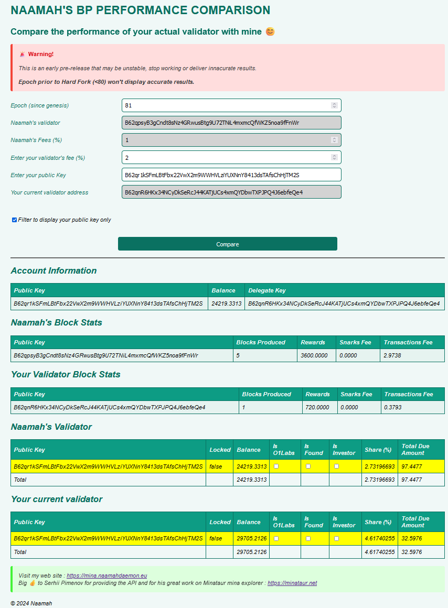

import bp from './naamah_bp_qrcode.png';

# Simulateur de Paiement Mina

Vous êtes-vous déjà demandé si les performances de votre validateur étaient aussi bonnes que prévu ?
Comment se comparent-elles avec celles des autres validateurs ?
Et si vous pouviez les comparer à un autre validateur basé sur des données réelles d'une Epoch ?

:::question
**Combien auriez-vous reçu si vous aviez délégué à X plutôt qu'à Y pour cette Epoch ?**
!!!

Ne vous poseez plus la question ! Maintenant, vous pouvez comparer les performances de votre validateur avec les miennes (ou celles de tout autre validateur) !!

J'ai rendu cet outil disponible pour vous.

Entrez votre clé, cliquez sur **compare**, et c'est parti !

Vous trouverez l'outil ici :

https://naamahdaemon.github.io/payout.html

:::warning disclaimer
Cet outil est fourni tel quel.
Il s'agit d'une première version qui peut comporter des bugs ou des incohérences.
Je l'ai testé cependant, et les résultats me semblent fiables.
:::

N'hésitez pas à me contacter si vous avez des questions, des problèmes ou des commentaires.

* Discord  
naamah#8064  
* Serveur Discord de Naamah  
https://discord.com/invite/ZkqQw8dK4E
* Telegram  
https://t.me/naamahdaemon
* Twitter  
https://twitter.com/NaamahDaemon

 

# Soutenez-moi en déléguant à mon validateur !

:::note Adresse de mon validateur 
B62qpsyB3gCndt8sNz4GRwusBtg9U72TNiL4mxmcQfWKZ5noa9fFnWr
:::

