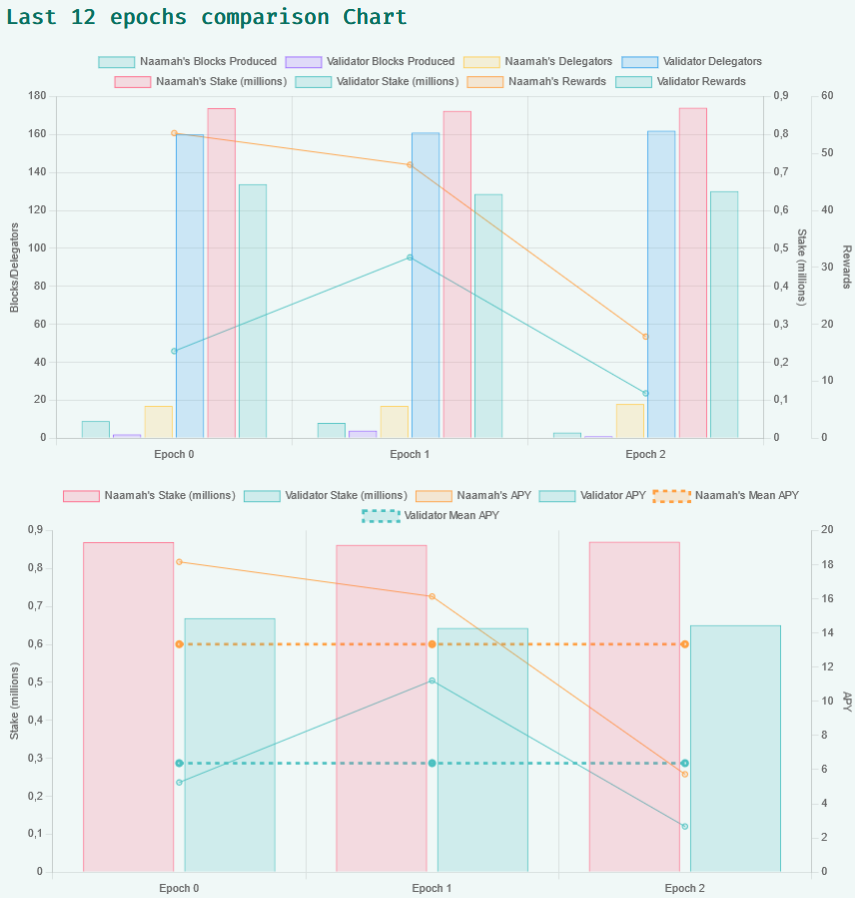

import bp from './naamah_bp_qrcode.png';
import minapackage from './mina-package.jpg';
import minapackagecontent from './package-content.jpg';

# Le colis surprise de Mina pour les participants de Berkeley
Aujourd'hui, j'ai reçu un colis spécial de l'équipe Mina 😊

<br/>

<div class="text--center">

</div>

<br/>

Cette boîte a été envoyée à tous les membres de la communauté qui ont aidé à la transition de Mina Berkeley.

Et ce que nous avions dans la boîte :

<br/>

<div class="text--center">

</div>

<br/>

**Merci à l'équipe Mina et à toute la formidable communauté Mina 🎉**

* * *

# Outil de simulation de paiement de Naamah mis à jour
Cette semaine, j'ai également mis à jour mon outil de simulation de paiement Mina.
Ajout de la comparaison des APY des Block Producers.

<br/>



<br/>

Voyez par vous-même :
  
https://mina.naamahdaemon.eu/payout-simulator
  
<br/>

# Soutenez-moi en déléguant à mon Block Producer !

:::note Adresse de mon validateur
```
B62qpsyB3gCndt8sNz4GRwusBtg9U72TNiL4mxmcQfWKZ5noa9fFnWr
```
<div class="text--center">

</div>
:::


