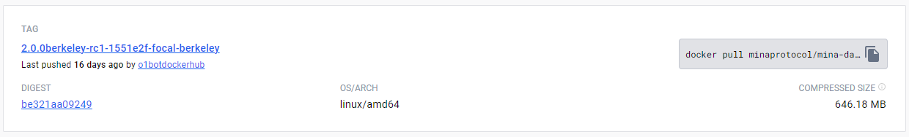
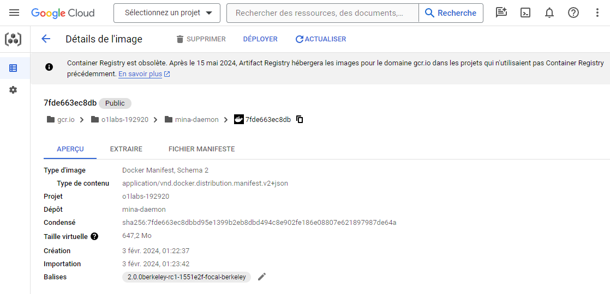

# Frequently Ask Questions
## Official documentation
Official documentation to run a berkeley node is available here (latest Berkeley release on Feb, 18th 2024):

https://github.com/MinaProtocol/mina/releases/tag/2.0.0berkeley_rc1

Some additional information about running a mina node with docker is available here (may not be up to date and may concern mainnet, devnet and not Berkeley but a source of inspiration anyway) :

:::info  Additional Documentation
* Staketab documentation
https://minanode.staketab.com/english/node-launch-options/running-mina-with-docker
* Official mina testnet documentation
https://docs.minaprotocol.com/node-operators/connecting-to-devnet
* Official mina mainnet documentation
https://docs.minaprotocol.com/node-operators/connecting-to-the-network#docker
:::
* * *
## Docker images
Mina docker images are available on Docker Hub :

* https://hub.docker.com/r/minaprotocol/mina-daemon/tags

For instance, the latest Berkeley RC1 release for Ubuntu Focal :


:::info  Links to Google Cloud images are also available in the Github release note :

* https://github.com/MinaProtocol/mina/releases/tag/2.0.0berkeley_rc1

> Every docker image is built for each of the supported platforms.
>
>To select the base docker image, replace CODENAME with the codename appropriate for your machine (focal, buster, or bullseye):
>
>* Mina Daemon: gcr.io/o1labs-192920/mina-daemon:2.0.0berkeley-rc1-1551e2f-CODENAME-berkeley
>* Mina Archive: gcr.io/o1labs-192920/mina-archive:2.0.0berkeley-rc1-1551e2f-CODENAME

So if you want to download the FOCAL latest release you can docker pull the following :

* https://gcr.io/o1labs-192920/mina-daemon:2.0.0berkeley-rc1-1551e2f-focal-berkeley


:::
* * *
## Usefull Docker CLI
### List available images
```bash
$ docker images
```
### List docker container
There are 2 ways you can list running docker containers :
```bash
$ docker container ls
```

or

```bash
$ docker ps
```

There are 2 ways you can list all containers :
```bash
$ docker container ls -a
```

or

```bash
$ docker ps -a
```

### Stop a running container
```bash
$ docker stop <container_name_or_id>
```

### Start a container
```bash
$ docker start <container_name_or_id>
```

### Remove a docker container
You can remove a Docker container :
```bash
$ docker rm <container_name_or_id>
```

### Reattach a detach container
You can detach a container to let it run in the background by using CTRL+p CTRL+q.
You may want to reattach a detached container. That can be achieved by :

```bash
$ docker attach <container_name_or_id>
```

### Removing all stopped containers
The docker container prune command is used to remove all stopped containers from your Docker environment. It's a convenient way to clean up your system by removing containers that are no longer in use

```bash
$ docker container prune
```

### Overriding Container entrypoint
Overriding the default container entrypoint can be really usefull to debug.
We used this in the "Running a node on Mina berkeley with docker documentation" to access the container through an interactive shell that allowed us to generate all keys before launching the mina dameon (that failed without this).

For this, you will use the `--entrypoint` Docker command line parameter allowing you to specify to launch a bash shell for instance

:::note  Exemple
```bash
$ docker run --name mina -p 9302:8302 -p 127.0.0.1:3085:3085 \
--mount "type=bind,source=$(pwd)/keys,dst=/root/keys" \
--mount "type=bind,source=$(pwd)/config,dst=/root/.mina-config" \
--env MINA_LIBP2P_PASS='pass' \
--env MINA_PRIVKEY_PASS='pass' \
--env UPTIME_PRIVKEY_PASS='pass' \
--entrypoint /bin/bash -it 353043fd4878
```
:::