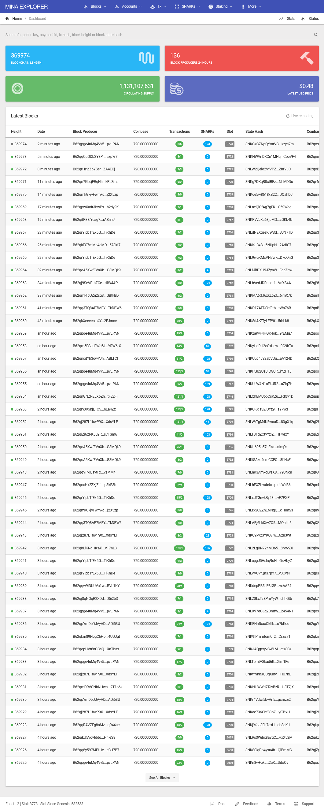
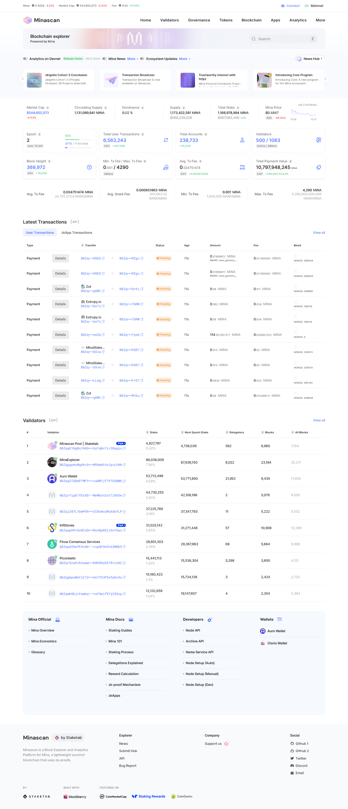
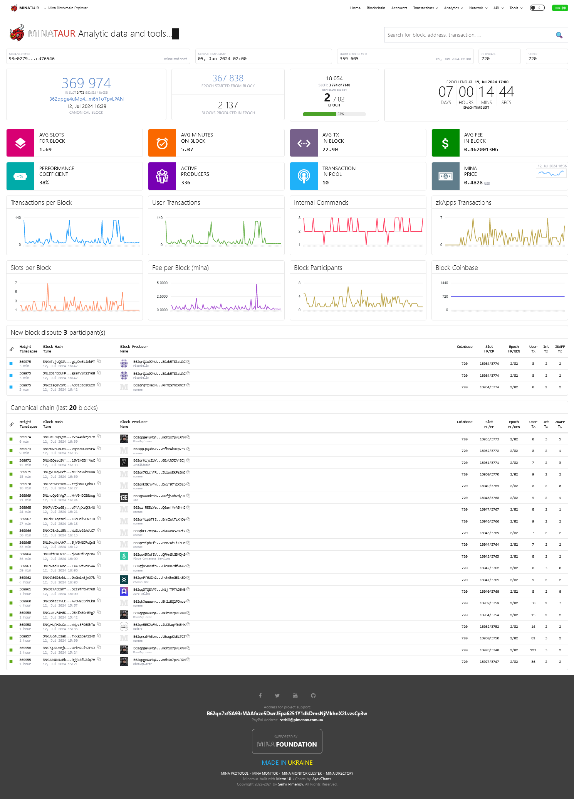

import bp from '../assets/naamah_bp_qrcode.png';

[//]: # (Explorateurs Mina)
# Explorateurs Mina
3 principaux explorateurs Mina sont disponibles :

## **Mina Explorer** *par Gareth Davis*
https://www.minaexplorer.com  



:::note
L'un des premiers (si ce n'est le premier) explorateur Mina disponible fourni par l'un des contributeurs Mina les plus incroyables de tous les temps !
:::

Vous trouverez presque tout ce dont vous avez besoin sur cet explorateur :

* [Production en temps réel des blocs de la blockchain](https://minaexplorer.com/blocks)
* [Informations sur les comptes](https://minaexplorer.com/ledger)
* [Informations sur les transactions](https://minaexplorer.com/transactions)
* [Production de Snarks](https://minaexplorer.com/snarks)
* [Registre de staking](https://minaexplorer.com/staking)
* [Rest Api](https://docs.minaexplorer.com/rest-api)

... et bien plus encore

:::info
Gareth propose également un proxy graphQL ici :  
https://graphql.minaexplorer.com/
:::

## **Minascan** *par Staketab*
https://minascan.io/mainnet/home  



:::note
Fournit de nombreux services et informations sur la blockchain
:::

* [Classement des validateurs](https://minascan.io/mainnet/validators/leaderboard)
* [Conditions générales des validateurs](https://minascan.io/mainnet/validators/terms)
* [Production en temps réel des blocs](https://minascan.io/mainnet/blocks)
* [Transactions des utilisateurs](https://minascan.io/mainnet/txs/user-txs)
* [Comptes des utilisateurs](https://minascan.io/mainnet/accounts)
* [Analyse de la blockchain](https://minascan.io/mainnet/analytics/network)

:::info
Staketab propose également l'API Blockberry disponible ici :  
https://docs.blockberry.one/reference/welcome-to-blockberry-api
:::

## **Minataur** *par Serhii Pimenov*
https://minataur.net/  



:::note
Un autre excellent explorateur Mina avec des fonctionnalités exclusives !
:::

Minataur fournit les informations habituelles sur la blockchain Mina :

* [Production en temps réel des blocs de la blockchain](https://minataur.net/blockchain)
* [Comptes](https://minataur.net/accounts)
* [Transactions](https://minataur.net/transactions)
* [Producteurs de blocs](https://minataur.net/producers)

... et bien plus encore

:::info
Serhii propose également des fonctionnalités exclusives telles que :  
* Restful Api  
https://minataur.net/api/restful
* Distribution graphique des blocs  
https://minataur.net/analytics/blocks-distribution
* Calculateur de profit  
https://minataur.net/tools/profit-calculator
:::

## Informations sur le validateur Naamah
Vous trouverez mon validateur sur chacun de ces explorateurs :

**minataur.net**  
https://minataur.net/account/B62qpsyB3gCndt8sNz4GRwusBtg9U72TNiL4mxmcQfWKZ5noa9fFnWr

**minaexplorer.com**  
https://minaexplorer.com/wallet/B62qpsyB3gCndt8sNz4GRwusBtg9U72TNiL4mxmcQfWKZ5noa9fFnWr

**minascan.io**  
https://minascan.io/mainnet/validator/B62qpsyB3gCndt8sNz4GRwusBtg9U72TNiL4mxmcQfWKZ5noa9fFnWr/delegations
  
N'hésitez pas à déléguer à mon producteur de blocs !

:::note Mon adresse de validateur 
```
B62qpsyB3gCndt8sNz4GRwusBtg9U72TNiL4mxmcQfWKZ5noa9fFnWr
```
<div class="text--center">

</div>
:::

