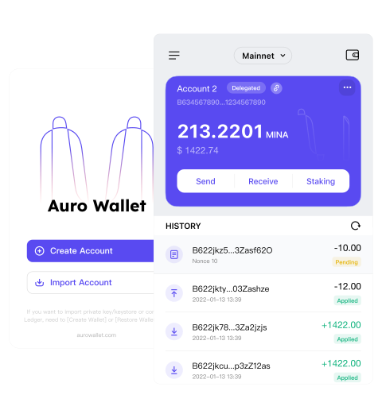
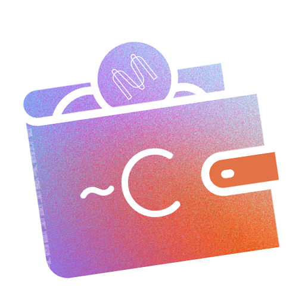

[//]: # (Non custodial wallets)
# Wallets "Non custodial"
## Qu'est-ce qu'un wallet non-custodial ?
Par définition, un wallet "non custodial" s'oppose à un wallet "custodial" et représente un wallet dont vous **possédez la clé privée** et sur lequel vous et vous seul avez la maitrise.

L'achat de mina nécessite de se connecter à une plateforme d'échange qui permet d'échanger une devise (Euro, USD, autre crypto, ..) contre des minas.

Une fois les minas en votre possession, ils sont disponibles via la plateforme d'échange et vous pouvez éventuellement procéder à des trades (short, long) sur vos token sur les paires d'échanges disponibles sur la plateforme.

:::info
Il n'existe quasiment aucune plateforme d'échange aujourd'hui qui vous permette d'accéder à votre clé privée qui est _du point de vue de la blockchain_ la seule preuve que vos token vous appartiennent.  
Au lieu de cela, les adresses de vos wallet sur les échanges vous sont attribués par la plateforme qui ne vous donne accès la plupart du temps qu'à la clé publique du wallet (qui vous permet de déposer des fonds) sans jamais vous donner accès à la clé privée (qui vous permet d'opérer, de sortir des fonds, de contrôler, ....) votre wallet.
:::

:::danger[CONCLUSION]
Vos tokens stockés sur un échange **ne vous appartiennent pas** !!!
                                   
:::

**Les avantages de conserver ses token sur une plateforme d'échange**  
L'avantage de stocker sur une plateforme d'échange (et il n'y en a qu'un !) est de pouvoir trader (=échanger / acheter / vendre) rapidement vos token.

**Les inconvénients de conserver ses tokens sur une plateforme d'échange**  
Il y a de nombreux désavantages à laisser ses tokens sur une plateforme centralisée :

* Le premier est que c'est en totale contradiction avec le principe même de la blockchain qui est d'être décentralisée.
* Le second inconvénient est que vous n'avez aucun contrôle en théorie sur vos fonds. Si la plateforme met la clé sous la porte, vous perdez alors 100% de vos investissements !!
* Le troisième inconvénient concerne le **staking**. Le staking dans le contexte d'une blockchain basée sur le **P**roof **O**f **S**take (PoS) comme Mina consiste à **déléguer1** ses token à un **validateur2** de confiance afin de lui octroyer des chances supplémentaires de **produire des blocs3** générant des récompenses (**coinbase4**).
Ces récompenses sont ensuite distribuées aux délégateurs au prorata du nombre de mina délégués moins la commission prise par le validateur (En théorie entre 0% et 10%, la majorité appliquant un taux de 5%).
Lorsque vos minas sont stockées sur une plateforme, dans le meilleur des cas, celle-ci propose leurs propres conditions de staking a des taux de commission élevés mais la plupart des plateformes ne propose tout simplement pas de staking, vous privant alors d'une source de revenu passive loin d'être négligeable (entre 12% et 24% d'APR)
* Le quatrième inconvénient est qu'un wallet _non custodial_ ne permet pas l'utilisation de ce wallet sur des applications spécifiques de la blockchain (DApps ou **zkApps5** dans le contexte Mina).

:::note[1 Staking]
Plus d'info sur le staking dans la section dédiée.  
Cliquez ici : 🔗[Staking Guide](<./Staking guide.md> )
:::

:::note[2 Validateur]
Généralement, dans une blockchain basée sur du Proof of Stake, un validateur est un participant à la blockchain qui bloque un certain montant de token  en garantie.  
Cette garantie sert de dépôt de sécurité et garantit que les validateurs ont un intérêt financier à maintenir l'intégrité du réseau.  
Dans le contexte de Mina, il est important de noter que **les fonds mis en jeu pour le staking ne sont pas vérouillés**  
Cela signifie que les fonds des délégateurs utilisés pour le staking peuvent être déplacés, re-délégués, un-délégués, transférés, échangés, vendus librement à tout moment.

:::

:::note[3 Blocs]
Les validateurs se relaient pour créer de nouveaux blocs et valider des transactions en fonction de la quantité de cryptomonnaie qu'ils ont mise en jeu (en propre ou via des délégations).  
Plus un validateur a de cryptomonnaie en jeu (ou de token délégués) , plus il a de chances d'être choisi pour créer un nouveau bloc.
:::

:::note[4 Coinbase]
Les validateurs sont récompensés par des cryptomonnaies supplémentaires pour avoir créé et validé avec succès des blocs.  
Le **coinbase** est une transaction spéciale dans un bloc nouvellement créé qui contient la récompense due au validateur ayant produit le nouveau bloc.
Actuellement la base de la récompense pour la production d'un bloc sur mina est des 720 minas, auquel s'ajoute 720 minas supplémentaires (supercharged reward) si le slot de production a été gagné par une adresse **non lockée**.
:::

:::note[5 zkApps]

:::

## Quels sont les wallets "non-custodial" Mina disponibles ?
### Auro Wallet
_site officiel_ : https://www.aurowallet.com/

**Description (Site Web Officiel)**  
Disponible sous la forme d'une extension de navigateur et d'une application mobile, Auro Wallet est disponible dans plusieurs langues, prend en charge parfaitement le protocole Mina et est entièrement open-source. Avec lui, vous pouvez facilement envoyer, recevoir ou staker vos MINA, et consulter votre historique de transactions à tout moment. 
Il prend également en charge l'envoi de transactions zkApp (lorque les apps seront disponibles sur le mainnet (_ndlr_))  

[//]: # (ALIGN)

**Mon Avis**  

[//]: # (ALIGN)

Les avantages de Auro Wallet :
* Disponible sous la forme d'une application Android ou iOS
* Disponible sous la forme d'une extension de navigateur (Chrome, Edge, Firefox)
* Compatible Hardware Wallet Ledger
* Prêt pour les zkApps
* Gestion de plusieurs Wallet
* Staking inApp
* Open source

[//]: # (ALIGN)

### Clorio Wallet
_site officiel_ : https://clor.io/

**Description (Site Web Officiel)**  
Clorio est un wallet open source pour le protocole Mina, écrit en JavaScript.  
Avec Clorio, vous pouvez interagir avec la blockchain Mina en générant/utilisant votre clé privée ou en utilisant le wallet matériel Ledger.  
Le portefeuille Clorio ne transmet pas votre clé privée en dehors de l'application client, toutes les transactions sont signées localement ou sur votre appareil Ledger.  
Clorio est un wallet non-custodial, ce qui signifie que vous êtes le seul responsable de la conservation sécurisée de votre clé privée.  
Vous êtes essentiellement votre propre banque.  

[//]: # (ALIGN)

**Mon Avis**  

[//]: # (ALIGN)

Les avantages de Clorio :  

* Disponible en tant qu'application de bureau (windows, Mac OSX and Linux)
* Compatible pour Ledger hardware wallet
* Multi-account, wallets management
* Easy inApp staking
* Open source