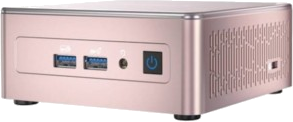

# Opérer un noeud de réseau Mina
Le lien vers la documentation officielle pour installer, configurer et faire tourner un noeud de validation se trouve ici :  

https://docs.minaprotocol.com/node-operators/getting-started  

La documentation officiel est très bien écrite, didactique et très claire.

:::info
Cette page n'a pas pour vocation de reproduire cette documentation, je vous recommande fortement de suivre la documentation officielle.  
Vous trouverez ici des informations complémentaires concernant certaines questions que je me suis posées lors de la configuration initiale et de l'exécution d'un nœud pour la première fois.  
Anisi que des questions très souvent posées sur le discord officiel de Mina.
:::

## Pré-requis
La documentation officielle précise les exigences matérielles et logicielles suivantes pour exécuter un nœud :

> **Logiciel** : Les environnements pris en charge incluent macOS, Linux (Debian 10, 11 et Ubuntu 20.04 LTS), et toute machine hôte avec Docker.  
> 
> **Processeur** : Seule l'architecture CPU AMD64 est prise en charge.  
>  
> **Matériel** : L'envoi et la réception de MINA ne nécessitent aucun matériel spécial.  
>  
> Pour exécuter un producteur de blocs sur le réseau Mina, vous aurez besoin d'au moins :  
> 
>- Processeur 8 cœurs  
>- 16 Go de RAM  
>  
> :::note[Exécution d'un ou plusieurs Snarks Worker]  
> Une quantité supplémentaire de RAM est nécessaire pour exécuter un ou plusieurs SNARK workers en même temps qu'un producteur de blocs.  
> :::
> 
> **Réseau** : Au moins une connexion de 1 Mbps.  
>  
> **Instances VM officiellement testées :**  
> 
> O(1) Labs a testé l'exécution de nœuds sur plusieurs fournisseurs de cloud et recommande les instances suivantes pour les besoins de base des opérateurs de nœuds.  
> Des exigences personnalisées et des contraintes de coût différentes peuvent nécessiter un type d'instance différent.  
> 
>- AWS c5.2xlarge  
>- GCP c2-standard-8  
>- Azure Standard_F8s_v2  
>- Digital Ocean c-8-16gib  

:::info[Remarque complémentaire sur les pré-requis]
Concernant les recommandations officielles, j'ajouterais un certain nombre de remarques ci-dessous.
:::

* Concernant le matériel supporté  
A noter que seul les processeurs Intel/AMD 64 sont supportés.  
Inutile d'essayer de faire tourner Mina sur un Raspberry Pi !!  

* Concernant les systèmes d'exploitation supportés  
A la liste officielle, il est bon de rajouter qu'une distribution linux (ex: Ubuntu 20.04) installée via WSL2 (Windows Linux Sub-System) permet de faire tourner un noeud de validation ainsi que l'ensemble des fonctionnalités associées (Snark Worker, ..) sans aucun souci aussi facilement que sur une machine Linux nativement.  
Il est bien entendu aussi possible d'utiliser Docker™ sur Windows pour installer Mina.  

* Concernant la puissance de la machine / quantité de mémoire requises  
S'il est possible de faire tourner Mina, d'après les recommandations officielles sur une machine équipée d'un processeur 8 coeurs et de 16Go de RAM. Par expérience, je recommande **très fortement** une machine équipée d'un CPU 16 coeurs et de 32Go de RAM.  

:::note
Je ne suis **jamais** parvenu à produire et broadcaster un bloc dans les temps avec une machine équipée d'un processeur 8 coeurs et de 16Go de RAM !!
:::

:::note
Mina n'exploite pas (encore) la puissance des cartes graphiques pour la validation.  
Inutile donc d'être un Gamer pour faire tourner un noeud de validation.  
Seule la puissance du CPU est utilisée.  
:::

:::note[génération de processeurs]
D'autre part la génération du CPU revêt aussi une importance significative. Un processeur datant de plusieurs années, à nombre de coeurs/threads égaux sera beaucoup moins puissant qu'un processeur récent.  

**Je recommande un Ryzen 7 7700 qui vous assurera une puissance plus que suffisante pour la production de blocs et de Snarks**
:::

* Concernant les fournisseurs cloud / VPS / VM et serveurs dédiés
En plus de la liste officielle fournie par Mina qui comprend les acteurs majeurs du Cloud (AWS, Azure, GCP, Digital Ocean), il est possible de trouver d'autres fournisseurs proposant des serveurs dédiés et/ou VM permettant de faire tourner un noeud de validation.  
A noter toutefois que la politique d'utilisation de ces fournisseurs peut interdire l'utilisation des machines pour tout usage concernant la blockchain et en particulier la mise en oeuvre d'un noeud de validation qu'il soit en PoW ou en PoS.  

Il est bon de préciser aussi que le coût de fonctionnement d'une machine louée ou d'une VM dédiée dans un environnement cloud peut être extrêmement prohibitif et au final ne pas s'avérer rentable.
Ce coût peut aller de plusieurs dizaine d'Euros par mois (50-90) pour un serveur dédié à plusieurs centaines d'Euros par mois (300-800) pour les services cloud les plus chers (GCP, Azure, AWS, ..)  

:::danger
Il est donc très important de mesurer la rentabilité du projet avant de s'engager dans des frais récurrents qui peuvent s'avérer très élevés.  
D'autant qu'il est souvent souhaitable/indispensable d'assurer une redondance au niveau des machines (entre 2 et 3 serveurs) -ce qui multiplie les coûts- afin d'assurer le fonctionnement de la blockchain en continue.  
:::

:::tip[Alternative]
La meilleure alternative en terme de coût, service, philosophie de la blockchain et décentralisation reste bien entendu le fonctionnement d'un noeud de validation local, non déporté chez un fournisseur tiers.  
Pour cela, n'importe quel ordinateur suffisament puissant peut faire l'affaire à la condition que cette machine puisse rester connectée au réseau 24/7.  
Il existe des mini-PC suffisament puissant (Ryzen 7, Core i7/i9) très abordable permettant de faire tourner un noeud de validation local de chez soi.  
Exemple : le Geekm A5 équipé d'u Ryzen 7 5800H et 32Go de RAM (entre 400€ et 450€)  
|  | https://www.geekom.fr/geekom-a5-mini-pc |
| -- | -- |

:::