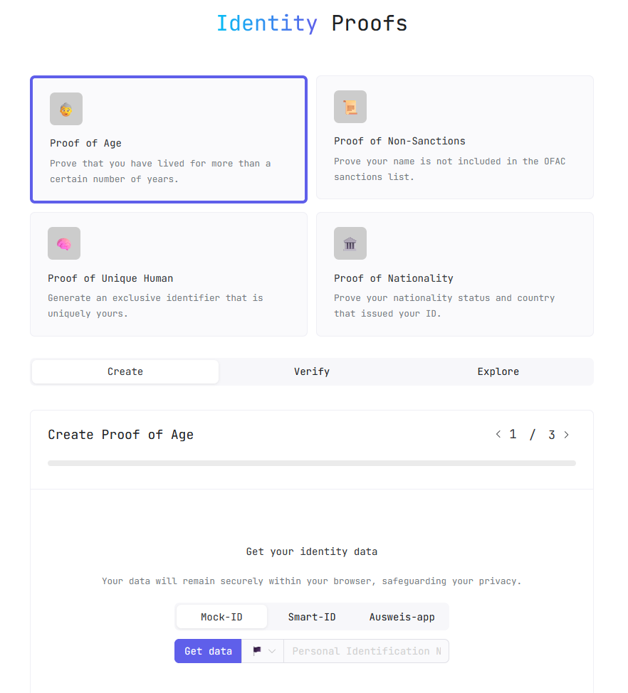
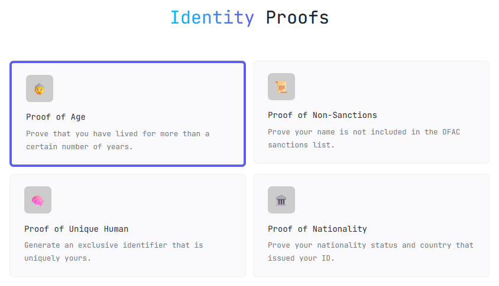
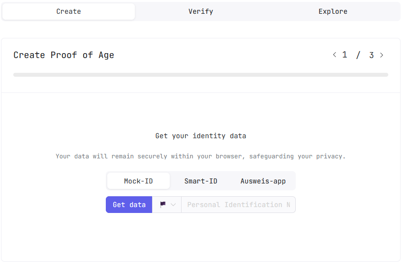
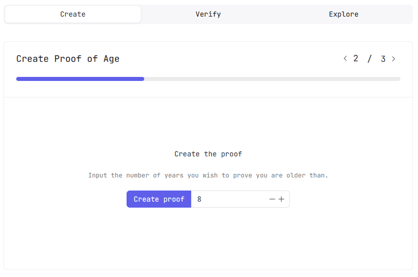
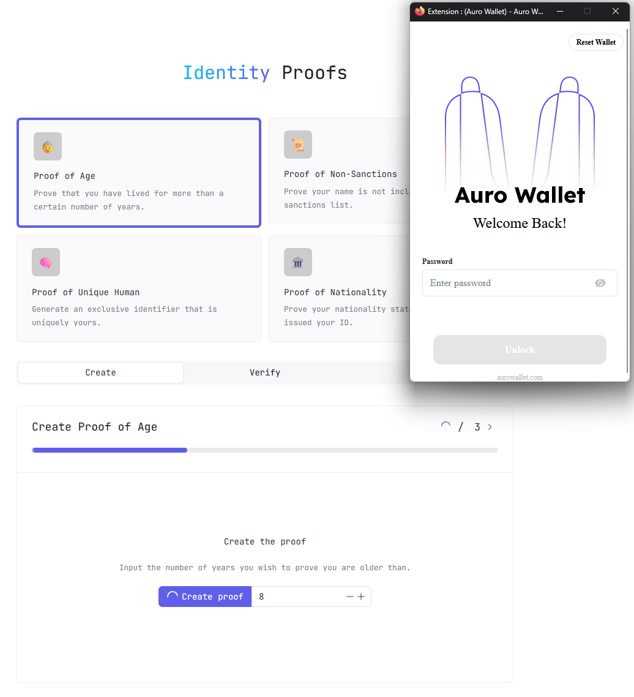
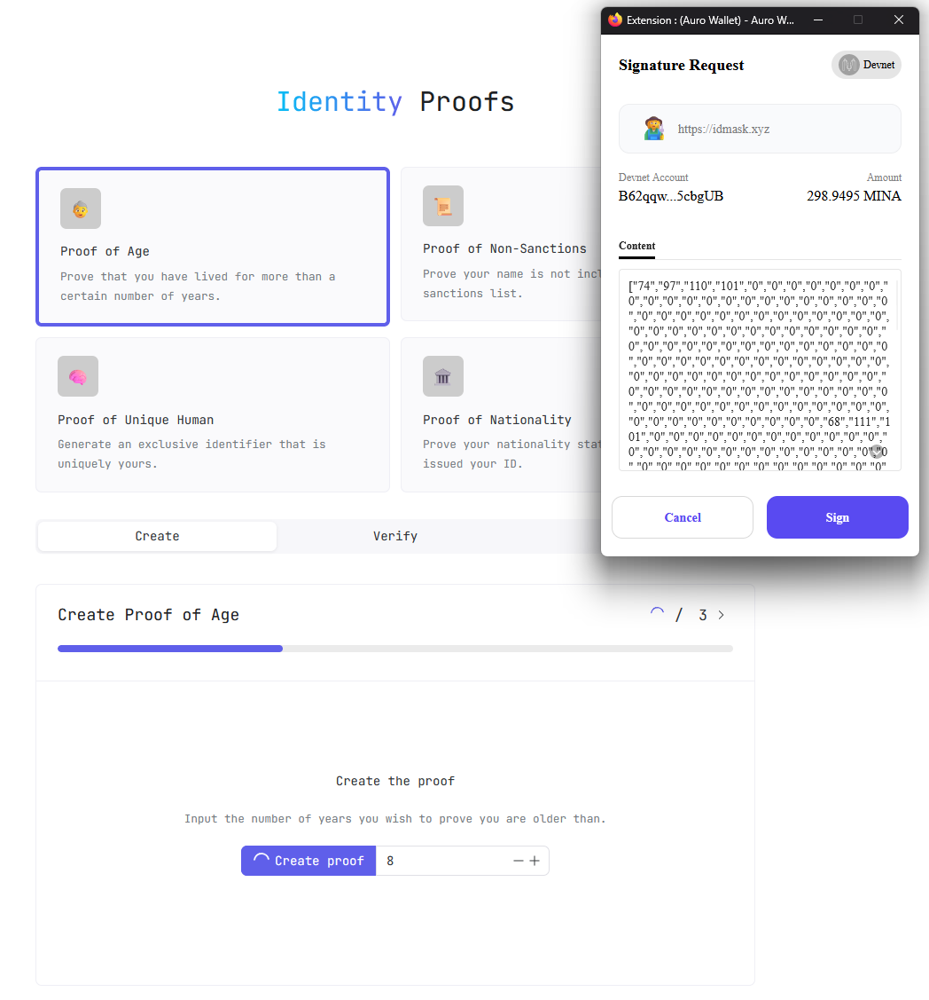
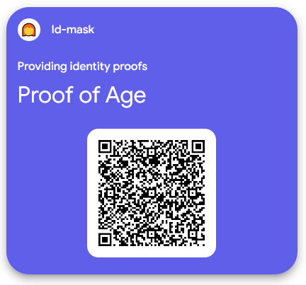
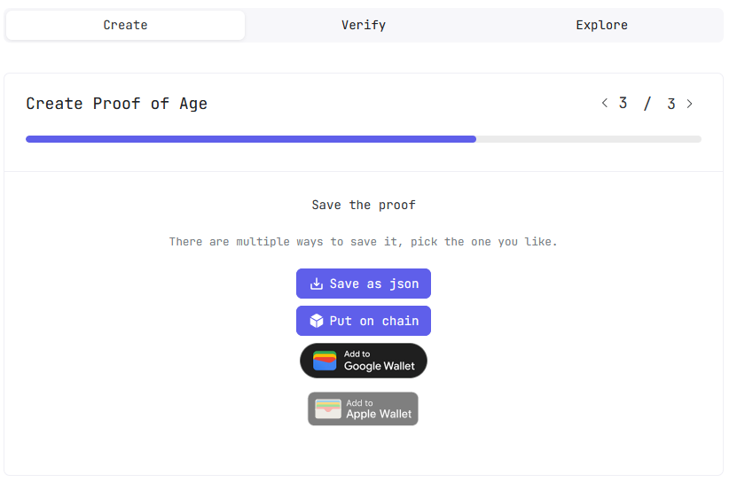
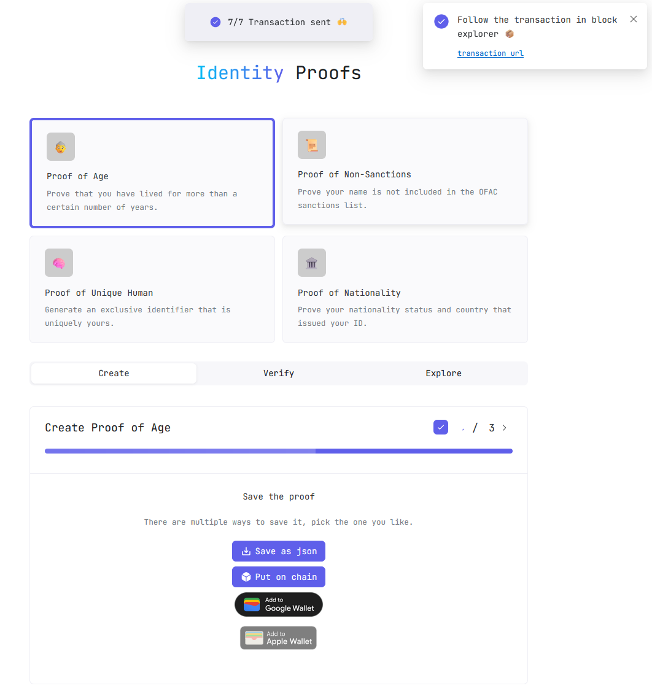
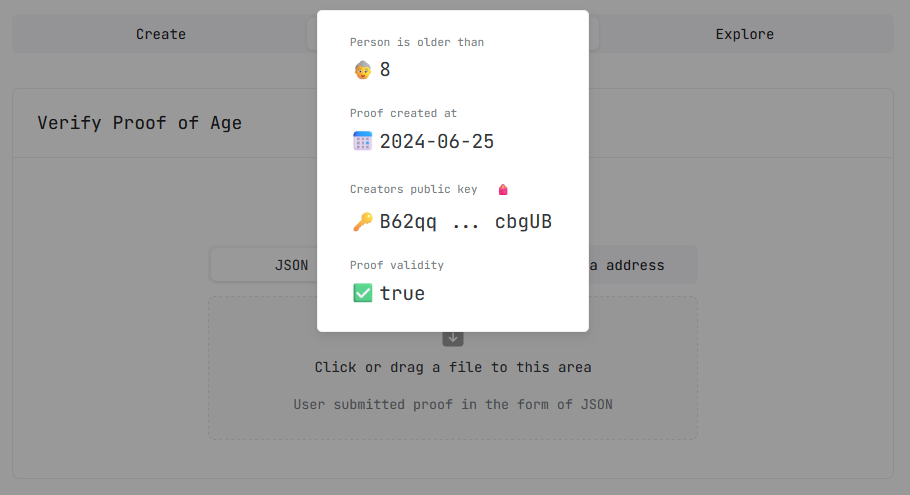

# ID-Mask

## Fichier d'identité de l'application

|  Paramètre | Valeur |
| ---- | ----- |
| **Auteur** | [maren@ethenticator.io](mailto:maren@ethenticator.io) |
| **Contacts** | Discord ID: iowxss6 |
| **Twitter / X** | https://twitter.com/RaidasG |
| **URL**  | https://idmask.xyz |
| **Code** | https://github.com/id-Mask |
| **Documentation officielle** | https://docs.idmask.xyz/ |
| **Disponibilité** | TESTNET / MAINNET |

## Adresses des smartcontracts sur le TESTNET

|  Param | Value |
| ---- | ----- |
| Proof of age          | https://minascan.io/devnet/account/B62qqpAFkz374qJpuFKYZPjT1KxSmnLoY4zEc878FaW4DSxgYNXZiny |
| Proof of non-sanction | https://minascan.io/devnet/account/B62qqhjvvE3dwiX2hF2cZRfmHA7euo8MrzvZhPHgXJNb57vuiWePAWC |
| Proof of unique human | https://minascan.io/devnet/account/B62qk9ydrTZwmHDVC2CNjQz7FGUkpMhaK2LMTGecX6484PakNCzegzn |
| Proof of nationality  | https://minascan.io/devnet/account/B62qnVvgzispkNmAoPCFGn5bpUiYxd84aakDnqHQDaPsYew2nL3SSKH | 

## Adresses des smartcontracts sur le MAINNET

|  Param | Value |
| ---- | ----- |
| Proof of age          | https://minascan.io/mainnet/account/B62qqpAFkz374qJpuFKYZPjT1KxSmnLoY4zEc878FaW4DSxgYNXZiny |
| Proof of non-sanction | https://minascan.io/mainnet/account/B62qqhjvvE3dwiX2hF2cZRfmHA7euo8MrzvZhPHgXJNb57vuiWePAWC |
| Proof of unique human | https://minascan.io/mainnet/account/B62qk9ydrTZwmHDVC2CNjQz7FGUkpMhaK2LMTGecX6484PakNCzegzn |
| Proof of nationality  | https://minascan.io/mainnet/account/B62qnVvgzispkNmAoPCFGn5bpUiYxd84aakDnqHQDaPsYew2nL3SSKH | 

* * *
## Visuels de l'application

* * * 
## Description de l'application
Depuis le site web original :

:::info  Description
ID-Mask est une application qui permet de créer des preuves à divulgation nulle de connaissance (zero-knowledge proofs), permettant aux individus de vérifier des déclarations sur leur identité à des tiers sans divulguer aucune information personnelle.  
  
Les preuves produites peuvent être utilisées par d'autres parties qui les trouvent utiles, par exemple d'autres applications, des gouvernements, des DEX, etc.
:::

ID-Mask permet à n'importe qui de générer plusieurs types de preuves, fournies par des sources de confiance (la source de confiance supportée sur le mainnet est l'application d'identité Smart-ID ([voir ci-dessous](#smartid)).  

* Preuve d'âge
* Preuve de non-sanction
* Preuve d'humain unique
* Preuve de nationalité

Il est possible de simuler la vérification d'identité sur testnet afin d'avoir un aperçu de son fonctionnement.  

:::note
Comme je ne peux pas utiliser Smart-ID dans mon pays, je n'ai pas pu tester la génération de preuves sur le mainnet.  
À la place, j'ai seulement effectué des tests sur le testnet en utilisant des données factices générées automatiquement.  
:::

Une fois la preuve générée, elle peut soit être conservée localement (preuve générée par le front-end) soit être propagée on-chain ou dans Google ou Apple Wallet pour pouvoir être présentée afin de prouver vos déclarations à un tiers vérificateur à tout moment.

* * *
## Settings

Les paramètre vous permettent de modifier le comportement de l'application :

* Changer de réseau (MAINNET / DEVNET)
* Modifier les URL de service (GraphQL endpoints, Explorer endpoints , ..)
* Activer le mode DEBUG dans la console
* Demander la signature à l'utilisateur lors de la génération de la preuve
* Utiliser le cache pour accélérer la génération et la vérification des preuves 
* ...

* * * 
## Essayons !
### Pré-requis
Pour tester ID-Mask, vous aurez besoin de :  

* Un portefeuille Mina (Auro / Clorio / Pallad)
* Une adresse Mina testnet que vous avez créée depuis votre portefeuille préféré
* Quelques Minas sur votre compte ([voir ci-dessous](#faucet))

Et c'est tout ce dont vous aurez besoin !

:::warning  Utiliser ID-Mask depuis votre téléphone mobile
Théoriquement, vous pouvez utiliser id-mask depuis le navigateur web intégré à votre portefeuille pour connecter votre adresse à ID-mask et signer les smart contracts.  
Il semble que pour l'instant, ce n'est pas vraiment utilisable depuis un téléphone mobile car la génération de preuves se fait côté front-end et nécessite une certaine puissance de calcul, ce qui est beaucoup trop long sur un téléphone mobile.  
Pour cette raison, je vous conseille d'essayer depuis votre navigateur web de bureau en utilisant l'extension web de votre portefeuille préféré.  
:::

### Génération de Preuves
Comme indiqué ci-dessus, ID-Mask peut générer 4 catégories de preuves :

* Preuve d'âge
* Preuve de non-sanction
* Preuve d'humain unique
* Preuve de nationalité

Essayons avec la première : **Preuve d'âge**

#### ÉTAPE 1 - Obtenir des données factices

#### ÉTAPE 2 - Créer la preuve
**Nous voulons prouver que nous avons plus de 8 ans**  

Si vous avez demandé dans les paramètres que votre portefeuille signe la preuve générée, alors votre portefeuille web extension devrait s'ouvrir et vous permettre de signer la demande.  

#### ÉTAPE 3 - Enregistrer la preuve générée
Une fois la preuve générée, vous pouvez l'enregistrer pour une utilisation ultérieure par un vérificateur :

* Dans un fichier JSON
* En la mettant on-chain
* En l'ajoutant à votre Google ou Apple Wallet

Mettons notre preuve on-chain en cliquant sur **Put on chain**.

:::note
Cela peut prendre un certain temps, soyez patient 😉
:::

Acceptez la transaction dans votre portefeuille

Une fois tout en ordre, vous remarquerez une popup vous informant que la transaction est maintenant on-chain.  
Vous pouvez cliquer sur le lien qui vous redirigera vers les détails de la transaction dans un explorateur Mina.  

Dans mon exemple : https://minascan.io/devnet/tx/5JvCdR2A9EQixYNCAEUUo4HbWzkgz7x2b4Zc762r5MCU1zw9Kj73?type=zk-tx

* * *
### Vérification de Preuve
Vous pouvez ensuite faire vérifier votre preuve générée soit par :
* Téléchargement du fichier JSON généré ci-dessus
* Vérification de votre adresse Mina si vous avez mis votre preuve on-chain
* Scan du QR Code de la preuve Google/Apple Wallet

* * * 
## Notes   

### smart-id
:::note  Application Smart-ID 
Smart-ID est une solution d'identification électronique conçue pour permettre aux utilisateurs de s'authentifier en ligne de manière sécurisée et de signer électroniquement des documents. Points clés sur Smart-ID :  

* Authentification Électronique  
Smart-ID permet aux utilisateurs de s'authentifier numériquement et de signer électroniquement des documents en ligne. Cela inclut les transactions bancaires, les services gouvernementaux, les contrats numériques, et plus encore.  

* Sécurité  
L'application utilise des méthodes de sécurité avancées pour protéger les informations personnelles des utilisateurs et garantir l'intégrité des transactions électroniques.

* Utilisation  
Smart-ID est largement utilisé dans les pays où il est déployé comme une alternative sûre et pratique aux méthodes traditionnelles d'identification et de signature.

* Pays d'Utilisation  
Initialement développé en Estonie, Smart-ID est maintenant utilisé dans plusieurs pays européens où il est intégré aux systèmes nationaux d'identification électronique.

* Applications Typiques  
Les applications typiques de Smart-ID incluent l'accès sécurisé aux services en ligne, l'authentification pour les services bancaires en ligne, l'accès aux services gouvernementaux numériques, la signature de documents électroniques, et plus encore.

Les pays où Smart-ID est couramment utilisé incluent l'Estonie, la Lettonie, la Lituanie, et d'autres pays européens où il a été adopté dans le cadre de leur infrastructure numérique.
:::

### Faucet DEVNET/TESTNET
:::note  Demander un FAUCET DEVNET/TESTNET 
Une fois que vous avez créé votre adresse de portefeuille sur TESTNET via Auro/Clorio/Pallad, vous pouvez demander des tMINA pour tester.  
Pour cela, remplissez votre adresse de portefeuille sur cette page : https://faucet.minaprotocol.com/
:::
